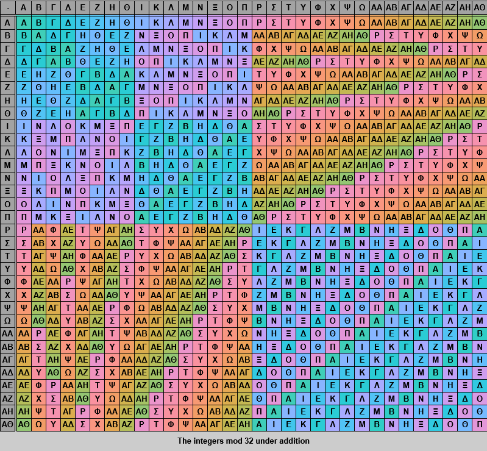

# `abs-alg`
Exploration of abstract algebra through Prolog.

## Images




-Cayley-Table.png)

## Features
- Groups
    - The integers mod N under addition: `z(N)`
    - The symmetric group on sets of N elements: `s(N)`
    - The general linear group of invertible matrices (limited to 2x2 and only for fields `z(P)` where `P` is prime): `gl(2, z(P))`
    - Product groups: `G1 x G2` (where `G1`, `G2` are groups)

## Core Protocol
To define a new group, implement the following `multifile` predicates from module `groups`:

```prolog
%! group_title(+Group, -Title:string) is det.
%! group_element(+Group, ?Element) is multi.
%! group_identity(+Group, -Identity) is det.
%! group_inverse(+Group, +Element, -Inverse) is det.
%! group_operator(+Group, +A, +B, -C) is det.
```

To define a new field, implement the following `multifile` predicates from module `fields`:

```prolog
%! field_element/2.
%! field_add_ident/2.
%! field_mul_ident/2.
%! field_add_inv/3.
%! field_mul_inv/3.
%! field_add_op/4.
%! field_mul_op/4.
```

